# Homework-4

Homework 4 has two components to be submitted:

1. A written document where you complete some derivations and describe your semester-long project. This will be submitted via Canvas.

1. A short coding example where you calculate reaction rates for chemical and electrochemical reactions. This will be submitted via GitHub (more, below).

## 1. Written Assignment
You will submit a written report (as a typed pdf uploaded to Canvas) to answer the following questions/derivations:

### 1.1 Relating thermodynamics and Kinetics
In class, we discussed that there are two approaches the determining the equilibrium state for a chemical reaction - chemical kinetic equilibrim and thermodynamic equilibrium.  The kinetic equilibrium is found by setting the rate of progress equal to zero, while the thermodynamic condition is found by setting the Gibbs energy of reaction to zero. 

Obviously, the two approaches must produce the same result, and are linked to one another by the fact that both equations involve the product of species activities, raised to their stoichiometric coefficients.

Derive an expression that relates the ratio of the forward and reverse kinetic rate constants: `(k_fwd/k_rev)` to the standard-state Gibbs energy of reaction `dG^o_rxn`.  As a starting point, use the following two equations:

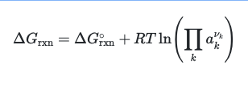

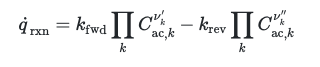

where the activity can be written as

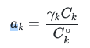

and the activity concentration as

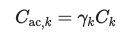

_Pay close attention to your units!_  Your answer should look something like:

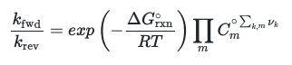

where the product is over all `m` phases participating in the reaction, and `k,m` are all the species `k` in the phase `m`.

### 1.2 Relating mass action kinetics and the Bulter-Volmer Form
In class, we have noted that one can model charge-transer kinetics using elementary mass-action kinetics:

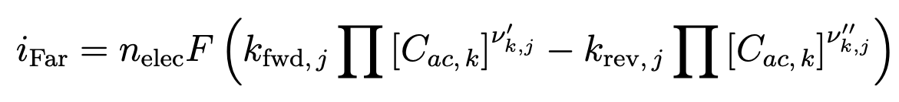

where the forward rate constant is

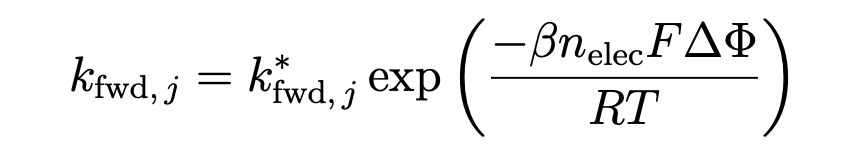

and the reverse rate constant is 

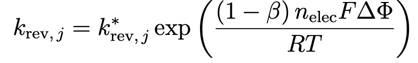

where `k^*` refers to the thermally-activated rate coefficient (i.e. without considering electric potential effects, such as from Arrhenius rate coefficients).

Alternatively, one could use Butler-Volmer kinetics to model a charge-transer reaction:

Please demonstrate that these two forms are equivalent, by deriving an equation for the exchange current density `i_o`:

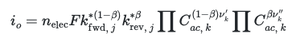

The first step is to use the definition of `eta`:

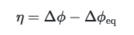

and of `delta Phi_eq`:

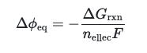

and substitute these into your equation.  Your answer to 1.1 might come in useful, as well.

Note that you can either start with the mass-action kinetics and try to derive Butler-Volmer, or the other way around.  Or set `i_Far` equal to `i_BV` and see where that leads you...

### 1.3 Semester-long project Identification
See the semester-long project description.  Identify and describe the system that you will model.  What is the device?  What are the components made of?  What type of process will you be modeling (a particular experiment, a mode of operation/application)?  And finally, what is the question you will attempt to answer (e.g. "I want to understand the effect of microstructure on XXX" or "I want to identify the optimum pressure for running YYY'').  As described in the project assignment, provide at least one reference from the literature to demonstrate why the application is important, or preferably why the parameter you choose is important. 

Lastly, if you are working with a partner, please list their name.

## 2. Coding Assignment
You will complete the Jupyter notebook template to calculate current density as a function of electric potential, using both the mass-action kinetics and Butler-Volmer approaches.

Please submit your notebook via pull request to the GitHub repository where you got this document.

